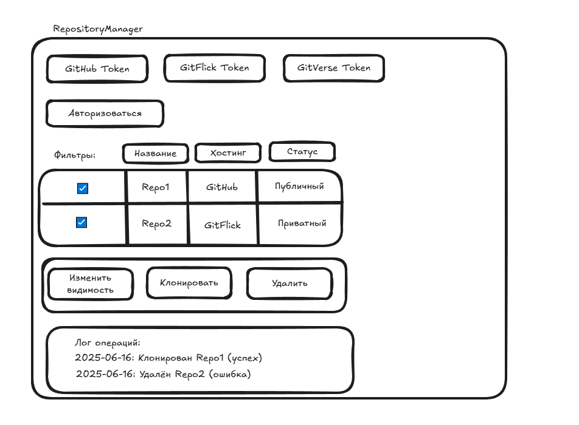

# Техническое задание  
на разработку автоматизированной системы управления репозиториями  

## 1. Общие положения  
**1.1. Полное и сокращенное наименование системы:**  
Полное: Автоматизированная система управления репозиториями.  
Сокращенное: АСУ Репозитории (RepositoryManager).  

**1.2. Наименование темы разработки:**  
Разработка системы автоматизации управления репозиториями на хостингах.  

**1.3. Основание для разработки:**  
Требование заказчика по оптимизации процессов управления репозиториями.  

**1.4. Наименование организации-заказчика и ее реквизиты:**  
Компьютерная академия Топ, Старинин Андрей Николаевич.  

**1.5. Наименование организаций-разработчиков:**  
Чечуй Матвей Олегович (индивидуальный разработчик).  

**1.6. Плановые сроки выполнения работ:**  
Начало: 16.06.2025  
Окончание: 29.06.2025  

**1.7. Порядок оформления и представления результатов работ:**  
- Предоставление заказчику программного продукта, исходного кода и документации.  
- Формат представления: электронный (PDF для документации, архив с исходным кодом).  

## 2. Описание автоматизируемых процессов  

**2.1. Текущие процессы (без автоматизации):**  
- Пользователь вручную заходит на веб-интерфейсы GitHub, GitFlick, GitVerse для управления репозиториями.  
- Изменение видимости (публичный/приватный) требует открытия каждого репозитория и изменения настроек.  
- Клонирование выполняется через командную строку (git clone) для каждого репозитория.  
- Удаление репозиториев требует подтверждения в веб-интерфейсе хостинга.  
- Нет централизованного управления репозиториями на разных платформах.  

**2.2. Автоматизируемые процессы:**  
- **Авторизация:** Ввод OAuth-токенов или API-ключей для GitHub, GitFlick, GitVerse.  
- **Просмотр:** Отображение списка репозиториев с фильтрами (название, хостинг, статус).  
- **Массовое изменение видимости:** Выбор репозиториев и изменение их статуса.  
- **Массовое клонирование:** Выбор репозиториев и их параллельная загрузка в директорию.  
- **Массовое удаление:** Выбор репозиториев с подтверждением перед удалением.  
- **Логирование:** Сохранение операций (дата, тип, результат) в текстовый файл.  

**2.3. Диаграмма вариантов использования (UML):**  


**2.4. Диаграмма Ганта:**


**2.5. Диаграмма классов:**


**2.6. Диаграмма последовательности:**


**2.7. Диаграмма состояний:**


## 3. Требования к функциональности  

**3.1. Поддерживаемые платформы:**  
- Windows (версии 10 и выше).  
- Linux (Ubuntu 20.04, Debian, Fedora и др.).  

**3.2. Поддерживаемые сервисы:**  
- GitHub.  
- GitFlick.  
- GitVerse.  

**3.3. Основные функции:**  
- **Авторизация:**  
  - Поддержка OAuth-токенов или API-ключей.  
  - Хранение данных безопасно (шифрование AES-256).  
- **Массовое изменение видимости:**  
  - Выбор списка репозиториев.  
  - Изменение статуса (публичный/приватный).  
- **Массовое удаление:**  
  - Выбор репозиториев.  
  - Подтверждение перед удалением.  
- **Массовое клонирование:**  
  - Выбор репозиториев.  
  - Загрузка в директорию.  
  - Параллельное клонирование.  

**3.4. Дополнительные функции (желательно):**  
- Просмотр репозиториев с фильтрами (название, хостинг, статус).  
- Логирование операций в текстовый файл.  
- Отмена операций (клонирование, изменение).  

## 4. Требования к системе  

**4.1. Требования к системе в целом:**  
- **4.1.1. Общие технические требования:**  
  - Работа на Windows 10+, Linux (Ubuntu 20.04, Debian, Fedora).  
  - Поддержка 1000 репозиториев в сеансе.  
  - Отклик операций: ≤5 секунд для 100 репозиториев.  
  - Система для одного пользователя.  
- **4.1.2. Требования к структуре:**  
  - Локальное приложение без сервера.  
  - Модули: управление репозиториями, API-интеграция, интерфейс.  
- **4.1.3. Режимы функционирования:**  
  - Одиночный режим (локальная установка).  
  - Интернет для API.  

**4.2. Требования к видам обеспечения:**  
- **4.2.1. Информационное обеспечение:**  
  - Данные о репозиториях в памяти.  
  - Логи операций в текстовом файле.  
- **4.2.2. Программное обеспечение:**  
  - Avalonia UI для интерфейса.  
  - .NET 8.0 для логики.  
- **4.2.3. Техническое обеспечение:**  
  - Компьютер: Windows 10+/Linux, 8 ГБ ОЗУ, Intel i5.  
- **4.2.4. Организационное обеспечение:**  
  - Обучение пользователя (1 день).  
  - Поддержка 30 дней после сдачи.  

**4.3. Требования к надежности:**  
- **4.3.1.** Обработка ошибок API (лимиты, недоступность).  
- **4.3.2.** Логирование операций.  
- **4.3.3.** Автосохранение логов при сбоях.  

**4.4. Условия эксплуатации:**  
- **4.4.1.** Локальная установка.  
- **4.4.2.** Обслуживание: обновление .NET.  
- **4.4.3.** Интернет для API.  

**4.5. Требования к техническим средствам:**  
- ОС: Windows 10+/Linux (Ubuntu 20.04, Debian, Fedora).  
- Процессор: Intel i5, 2.5 ГГц.  
- ОЗУ: 8 ГБ.  
- Диск: 500 МБ (установка), 10 ГБ (репозитории).  

**4.6. Требования к совместимости:**  
- **4.6.1.** Интеграция с API GitHub, GitFlick, GitVerse.  
- **4.6.2.** Совместимость с .NET 8.0.  

**4.7. Требования к безопасности:**  
- **4.7.1.** Шифрование API-токенов (AES-256).  
- **4.7.2.** Защита от несанкционированного доступа.  

**4.8. Требования к маркировке и упаковке:**  
Не применимо (электронная поставка).  

**4.9. Требования к транспортированию и хранению:**  
Не применимо (электронная поставка).  

**4.10. Специальные требования:**  
- Русский и английский языки интерфейса.  
- Единообразный интерфейс на Windows/Linux.  

## 5. Макет приложения  

**5.1. Описание интерфейса:**  
Главное окно включает:  
- **Панель авторизации:** Поля для API-токенов GitHub, GitFlick, GitVerse.  
- **Список репозиториев:** Таблица (название, хостинг, статус) с фильтрами.  
- **Панель операций:** Кнопки для изменения видимости, клонирования, удаления.  
- **Лог операций:** История операций (дата, тип, результат).  

**5.2. Пример макета (ASCII-арт):**  

```plaintext
+-----------------------------------------------+
| RepositoryManager                             |
+-----------------------------------------------+
| [GitHub Token] [GitFlick Token] [GitVerse Token] |
| [Авторизоваться]                              |
+-----------------------------------------------+
| Фильтры: [Название] [Хостинг] [Статус]        |
| +----+-------------+----------+----------+    |
| | ☑  | Repo1       | GitHub   | Публичный|    |
| | ☑  | Repo2       | GitFlick | Приватный|    |
| +----+-------------+----------+----------+    |
+-----------------------------------------------+
| [Изменить видимость] [Клонировать] [Удалить]  |
+-----------------------------------------------+
| Лог операций:                                 |
| 2025-06-16: Клонирован Repo1 (успех)         |
| 2025-06-16: Удалён Repo2 (ошибка)            |
+-----------------------------------------------+
```

**5.3. Макет интерфейса приложения:**



## 6. Требования к программной документации  
- **6.1.** Руководство пользователя (интерфейс, функции).  
- **6.2.** Техническая документация (архитектура, API).  
- **6.3.** Отчет о тестировании (функциональные и нагрузочные тесты).  

## 7. Технико-экономические показатели  
- **7.1.** Сокращение времени на управление репозиториями на 70%.  
- **7.2.** Стоимость разработки: определяется заказчиком.  
- **7.3.** Окупаемость: 6 месяцев.  

## 8. Стадии и этапы разработки  

**8.1. Методология разработки:**  
- **Scrum** с 3 спринтами по 4–5 дней.  
- Роли: разработчик (Чечуй Матвей Олегович), заказчик (Старинин Андрей Николаевич) как продуктовый владелец.  
- Инструменты: Trello для бэклога, ежедневные встречи (15 минут).  

**8.2. Стадии разработки:**  
1. Анализ и проектирование (16.06.2025–19.06.2025).  
2. Разработка (20.06.2025–27.06.2025).  
3. Тестирование и отладка (28.06.2025–29.06.2025).  
4. Ввод в эксплуатацию (29.06.2025).  

**8.3. Этапы разработки (спринты):**  
- **Спринт 1 (16.06.2025–19.06.2025):** Анализ требований, проектирование, макет интерфейса.  
- **Спринт 2 (20.06.2025–24.06.2025):** Логика (авторизация, API-интеграция), базовый интерфейс.  
- **Спринт 3 (25.06.2025–29.06.2025):** Операции (клонирование, удаление, изменение), тестирование, обучение.  

## 9. Порядок контроля и приемки  
- **9.1. Контроль:**  
  - Проверки в конце спринтов (демонстрация заказчику).  
  - Тестирование по п. 3.3, 3.4.  
- **9.2. Приемка:**  
  - Проверка требований п. 3.  
  - Тестирование API и операций на Windows/Linux.  
  - Оценка производительности.  
  - Подписание акта приемки.  

## 10. Порядок комплектования и передачи исходной информации  
- **10.1. Заказчик предоставляет:**  
  - Требования к API-интеграции.  
  - API-токены для тестирования.  
- **10.2. Исполнитель предоставляет:**  
  - Исходный код, программу, документацию.  
  - Формат: электронный (архив, облако).  

## 11. Источники разработки  
- ГОСТ 34.602-2020.  
- API-документация GitHub, GitFlick, GitVerse.  
- Документация Avalonia UI, .NET 8.0.